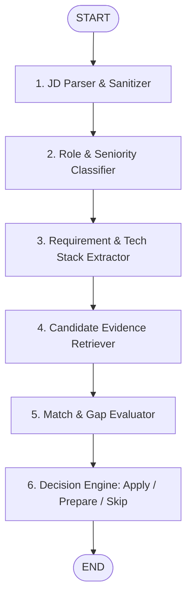
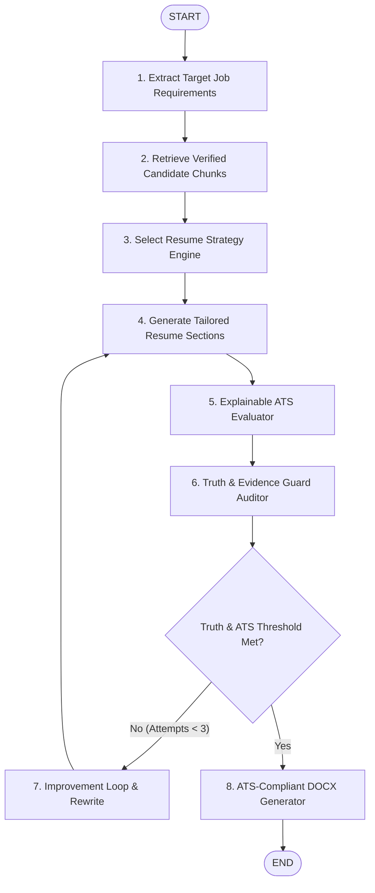
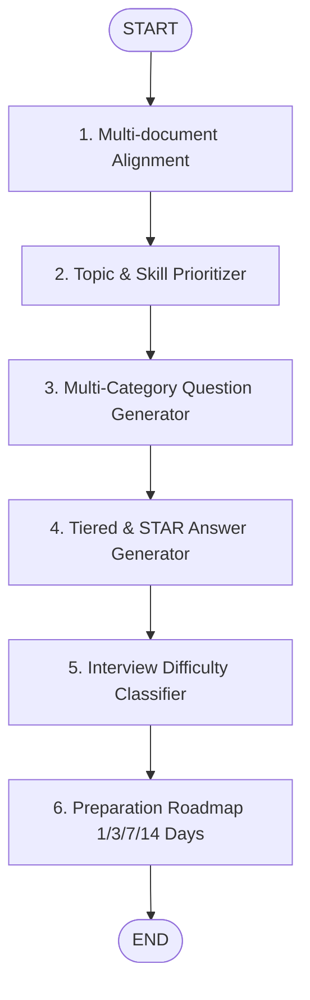
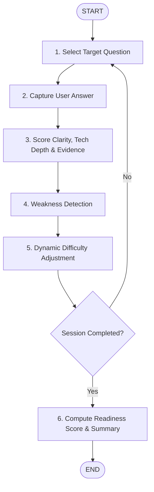

# CareerPilot AI — System Architecture Specification

## 1. System Overview

CareerPilot AI is an enterprise-grade, local, agentic AI career platform designed to deliver truthful, explainable job analysis, customized resume generation, and comprehensive interview preparation.

Unlike generic LLM wrappers, CareerPilot AI enforces a strict **Grounding & Truth Guardrail** system: it never invents skills, metrics, or experiences, and grounds all tailored resumes and personalized interview responses in atomic, verified candidate evidence stored in a local vector and relational database.

```
+---------------------------------------------------------------------------------------+
|                                    Streamlit UI                                       |
|  [Dashboard] [Analyze Job] [Applications] [Resume] [Interview Prep] [Mock] [Gaps]    |
+-------------------------------------------+-------------------------------------------+
                                            |
                                            v
+---------------------------------------------------------------------------------------+
|                               FastAPI / Application Layer                             |
|  - Request Orchestration                                                              |
|  - Graph State Management                                                             |
|  - Document Streaming & Download Handlers                                             |
+-------------------------------------------+-------------------------------------------+
                                            |
          +---------------------+-----------+-----------+---------------------+
          |                     |                       |                     |
          v                     v                       v                     v
+--------------------+ +--------------------+ +--------------------+ +--------------------+
| Job Analysis Graph | | Resume Gen Graph   | | Interview Prep     | | Mock Interview     |
| (JD Parsing, Fit   | | (Strategy, Tailor, | | Graph (Questions,  | | Graph (Turn-based, |
| Scoring, Decision) | | ATS, Truth Guard)  | | STAR Answers, Plan)| | Adaptive, Scoring) |
+---------+----------+ +---------+----------+ +---------+----------+ +---------+----------+
          |                      |                      |                      |
          +----------------------+----------+-----------+----------------------+
                                            |
                                            v
+---------------------------------------------------------------------------------------+
|                              Core Intelligence Subsystems                             |
|  +------------------------------+             +------------------------------------+  |
|  |     Truth & Evidence Guard   |             |       Explainable ATS Engine       |  |
|  | - Evidence Atomizer          |             | - Keyword Exact & Semantic Match   |  |
|  | - Claim Verifier             |             | - Section Structure & Formatting   |  |
|  | - Classification (3-tier)    |             | - Anti-Stuffing & Readability      |  |
|  +------------------------------+             +------------------------------------+  |
|  +------------------------------+             +------------------------------------+  |
|  |      RAG Dual-Store Engine   |             |       Pluggable LLM Layer          |  |
|  | - Candidate Evidence Store   |             | - Google Gemini Provider           |  |
|  | - Tech / Domain Prep Store   |             | - Local Ollama / OpenAI Adapter    |  |
|  | - Hybrid BM25 + Vector Search|             | - Deterministic Mock (Testing)     |  |
|  +------------------------------+             +------------------------------------+  |
+-------------------------------------------+-------------------------------------------+
                                            |
                                            v
+---------------------------------------------------------------------------------------+
|                               Persistence Layer (Local)                               |
|  - SQLite (Relational metadata, audit logs, applications, interview logs)             |
|  - ChromaDB (Vector embeddings for candidate evidence & interview technical concepts) |
|  - Local File Store (Generated DOCX, PDF originals, JSON exports)                     |
+---------------------------------------------------------------------------------------+
```

---

## 2. Pluggable LLM Provider Abstraction

CareerPilot AI abstracts all model interactions behind a unified interface:

```python
class BaseLLMProvider(ABC):
    @abstractmethod
    def generate_text(self, prompt: str, system_instruction: Optional[str] = None, temperature: float = 0.2) -> str:
        pass

    @abstractmethod
    def generate_structured(self, prompt: str, schema: Type[BaseModel], system_instruction: Optional[str] = None) -> BaseModel:
        pass
```

### Supported Providers:
1. **Google Gemini**: Uses `google-genai` and `langchain-google-genai` for high-speed, structured JSON generation with schema enforcement.
2. **Ollama / Local LLMs**: Direct REST / LangChain client targeting local models (e.g. `llama3.1:8b`, `qwen2.5:7b`, `mistral:7b`) for 100% offline air-gapped privacy.
3. **Mock Provider**: Zero-network test fixture provider returning deterministic, valid Pydantic models for fast unit and integration testing.

---

## 3. Dual-Store RAG Architecture

CareerPilot AI avoids dumping raw resumes into large LLM prompts. Instead, it segments knowledge into two isolated, high-precision retrieval stores:

```
                  +----------------------------------------------+
                  |              Dual-Store RAG                  |
                  +----------------------+-----------------------+
                                         |
               +-------------------------+-------------------------+
               |                                                   |
               v                                                   v
+------------------------------+                 +-----------------------------------+
|    Candidate Evidence Store  |                 |    Interview & Tech Knowledge     |
| (ChromaDB: candidate_store)  |                 |     (ChromaDB: interview_store)   |
+------------------------------+                 +-----------------------------------+
| Metadata:                    |                 | Curated technical domains:        |
| - chunk_id                   |                 | - Python, SQL, Data Engineering   |
| - section (exp, proj, skill) |                 | - Spark, GCP, AWS, BigQuery       |
| - skill_tags                 |                 | - Airflow, RAG, LangChain/Graph   |
| - verified_metrics           |                 | - LLMs, System Design, Behavioral |
| - confidence_level           |                 |                                   |
| - evidence_type              |                 | Focus: Deep conceptual questions, |
|                              |                 | trade-offs, architecture patterns,|
| Focus: Exact candidate truth |                 | failure modes, best practices.    |
+------------------------------+                 +-----------------------------------+
```

---

## 4. Truth Guard & Evidence Verification System

To eliminate LLM hallucinations, CareerPilot AI implements a strict **Evidence Classification Taxonomy**:

| Evidence Status | Meaning | System Action |
|---|---|---|
| `SUPPORTED` | Directly matched with candidate profile evidence chunk with verifiable metrics/details. | Allowed in tailored resume and personalized interview answers. |
| `PARTIALLY_SUPPORTED` | Adjacent skill or related experience logically plausible but lacks direct proof. | Flagged in UI with warning; disallowed in resume unless approved. |
| `NOT_SUPPORTED` | Skill or technology requested by JD that does not exist in candidate profile. | **STRICTLY BLOCKED** from resume. Identified as a **Skill Gap** for study. |

### Sanitization Pipeline:
1. Candidate profile is atomized into standalone verified facts (claims, metrics, technologies, tools).
2. Before any resume bullet is finalized, it passes through the `TruthGuardAuditor`.
3. Every claim in the bullet is mapped to candidate chunk IDs.
4. Any ungrounded bullet is rewritten to strip unsupported tools/metrics or rejected back to the generation loop.

---

## 5. LangGraph Agent Workflows

### 5.1 Job Analysis Graph


### 5.2 Resume Generation & Validation Graph


### 5.3 Interview Preparation Graph


### 5.4 Adaptive Mock Interview Graph


---

## 6. Explainable ATS Engine

CareerPilot AI avoids black-box claims by providing a transparent, rule-driven evaluation suite:
1. **Keyword Match Density**: Proportion of must-have and nice-to-have JD terms present in verified resume chunks.
2. **Semantic Alignment**: Cosine similarity between target job responsibility vectors and candidate experience vectors.
3. **Structure & Formatting**: Verification of standard ATS section headers (`Summary`, `Experience`, `Projects`, `Skills`, `Education`), standard bullet structure, absence of fragile nested tables/text boxes.
4. **Anti-Stuffing Penalty**: Penalizes artificial keyword stuffing that lacks narrative context.
5. **Truth Penalty**: Penalizes ungrounded claims.

---

## 7. Persistence & Data Schema

The database utilizes SQLite for lightweight, zero-configuration local deployment with optional PostgreSQL upgrade paths.

### Primary Entities:
- **`CandidateProfile`**: Root candidate information, summary, career preferences, target roles.
- **`CandidateEvidence`**: Atomic chunks of verified experience/projects with confidence tags.
- **`Experience`** & **`Project`**: Structured historical records with role, company, dates, achievements.
- **`Skill`**: Candidate skills categorized by domain (Language, Framework, Cloud, Database, Tool).
- **`JobDescription`**: Raw and parsed JD data, company name, role title, seniority, responsibilities.
- **`JobAnalysis`**: Computed fit scores, skill matches, gaps, risks, and decision recommendations.
- **`Application`**: Application tracker linking a candidate profile to a target JD, resume version, and status.
- **`ResumeVersion`**: Strategy used, tailored sections, ATS score, truth audit log, DOCX output path.
- **`InterviewQuestion`**: Generated questions classified by category, difficulty, target technology.
- **`InterviewAnswer`**: Generated short/medium/deep answers and candidate-grounded STAR answers.
- **`InterviewSession`** & **`MockTurn`**: User mock interview transcripts, turn-by-turn scores, and feedback.
- **`SkillGap`**: Persistent record of missing skills across target jobs with recommended learning paths.

---

## 8. User Interface Layout

The Streamlit UI is organized into 10 focused pages:
1. **Dashboard** (`1_Dashboard.py`): High-level overview of applications, overall fit metrics, top missing skills, and readiness.
2. **Analyze Job** (`2_Analyze_Job.py`): Paste/upload JD -> instant breakdown of role, responsibilities, fit score, risk, and Apply/Prepare action triggers.
3. **Applications** (`3_Applications.py`): Pipeline tracker of all saved applications, tailored resumes, and prep status.
4. **Resume Builder** (`4_Resume_Builder.py`): Tailor resumes across multiple strategies, inspect truth audit, and download clean DOCX.
5. **ATS Analysis** (`5_ATS_Analysis.py`): Comprehensive 7-component explainable ATS compatibility breakdown and keyword coverage matrix.
6. **Interview Preparation** (`6_Interview_Prep.py`): Multi-category questions with tiered answers, grounded STAR narratives, and multi-day study roadmaps.
7. **Mock Interview** (`7_Mock_Interview.py`): Real-time, 10-dimensional adaptive mock interviews across 7 interviewer personas and coaching modes.
8. **Skill Gaps & Trends** (`8_Skill_Gaps.py`): Aggregated analytics across all analyzed JDs showing market trends and study recommendations.
9. **Settings** (`9_Settings.py`): LLM provider toggle, API keys, model selections, and database maintenance.
10. **About** (`10_About.py`): Architecture, technology stack, and open-source security principles.

---

## 9. Security, Environment Modes & Deployment Safety

To facilitate public portfolio demonstrations without compromising private user data, CareerPilot AI implements a dual-mode isolation architecture:

### 1. Environment Modes
- **`DEMO` (Public Default):**
  - Uses synthetic ground truth in `data/demo/` (Alex Rivera profile).
  - Uses isolated demo SQLite database (`data/demo/careerpilot_demo.db`).
  - Safe for public web deployment on Streamlit Community Cloud or Hugging Face Spaces.
- **`LOCAL_PRIVATE`:**
  - Uses private candidate ground truth in `data/candidate/` or `data/private/`.
  - Strictly protected by `.gitignore` rules.

### 2. System Health & Diagnostics Engine (`careerpilot/health.py`)
- Evaluates 7 independent system vectors: Configuration, Candidate Ground Truth, Technical Knowledge Base, Database Connectivity, Local Embeddings, Vector Store Collections, and LLM Provider Status.
- Emits aggregated status (`HEALTHY`, `DEGRADED`, `UNAVAILABLE`) displayed in UI diagnostics and automated testing.

