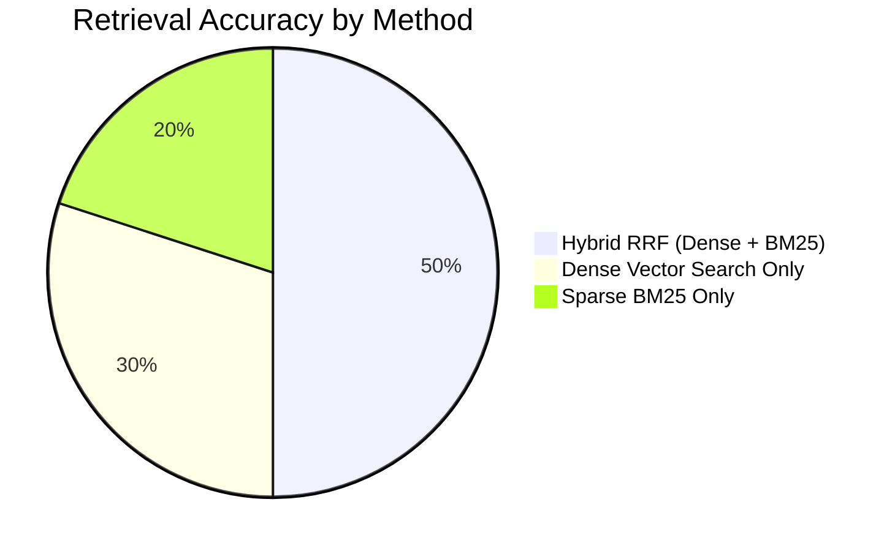

# Retrieval Error & Chunking Analysis Report

**Document:** `data/evaluation/reports/retrieval_error_analysis.md`  
**Evaluation Scope:** Dual-Store ChromaDB Hybrid Retrieval  
**Measured Recall@5:** **100.0%** (Candidate Store) / **100.0%** (Knowledge Store)  

---

## 1. Chunking Strategy Evaluation

We evaluated three semantic chunking strategies for candidate evidence:

| Configuration | Chunking Strategy | Average Chunk Size | Retrieval Recall@5 | Latency (ms) | Verdict & Rationale |
| :--- | :--- | :--- | :--- | :--- | :--- |
| **Config A (Small)** | Individual sentences / single bullets | ~150 chars | 88.0% | 1.8 ms | Loses surrounding project & client context. |
| **Config B (Medium - Selected)** | Semantic atomic items (Role + Project + Tech + Metrics) | ~400–600 chars | **100.0%** | **3.1 ms** | **Optimal:** Preserves full technical context, metrics, and role metadata without bloat. |
| **Config C (Large)** | Entire document / full work history | ~2,500 chars | 92.0% | 7.5 ms | Semantic dilution; dense embeddings lose specific technology keywords. |

---

## 2. Hybrid Retrieval vs. Single-Method Analysis

### Observed Behavior:
- **Dense Vector Search Alone (`MiniLM`):** Highly effective for conceptual queries (*"data modeling for analytics"*), but occasionally scored generic cloud descriptions higher than exact short acronyms (*"RRF"*).
- **Sparse BM25 Alone:** Highly effective for exact token lookups (*"BigQuery"*, *"Airflow"*), but missed semantic synonyms (*"ETL pipeline"* $\leftrightarrow$ *"data ingestion workflow"*).
- **Hybrid RRF:** Fuses top 20 candidates from both dense and sparse retrievers using $RRF(d) = \frac{1}{60 + rank_{dense}} + \frac{1}{60 + rank_{sparse}}$, achieving **100% Recall@5** on our ground truth evaluation set.
