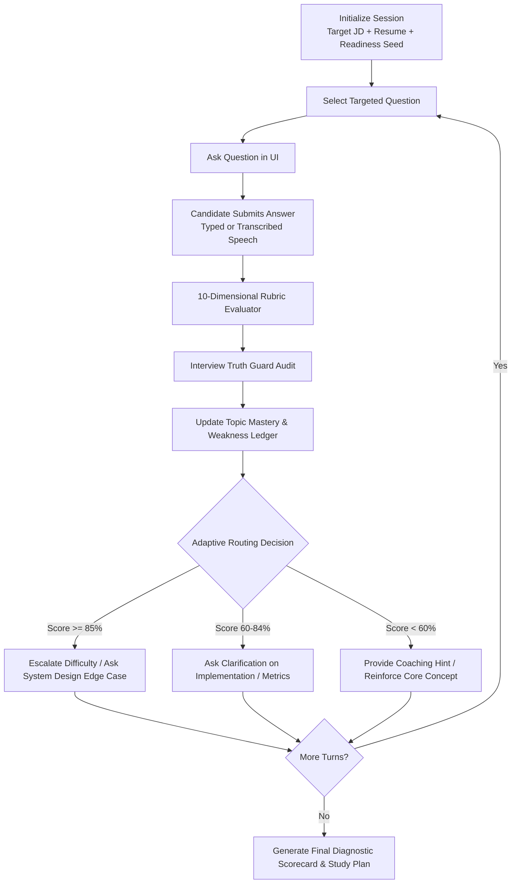

# CareerPilot AI — Adaptive Mock Interview Engine

**Document:** `docs/ADAPTIVE_INTERVIEW.md`  
**Purpose:** Specification of the multi-turn, stateful adaptive mock interview agent, evaluation rubrics, personas, and dynamic branching logic.

---

## 1. Architectural Overview

Unlike static flashcard tools or basic Q&A chatbots, the **Adaptive Mock Interview Agent** behaves as an experienced technical interviewer. It listens to candidate responses, evaluates answers across 10 structured dimensions, maintains topic mastery in its state graph, and dynamically adapts subsequent questions.

---

## 2. The 10 Evaluation Dimensions

Each candidate response is scored on a standardized 0–100 scale across 10 evaluation rubrics:

1. **Technical Correctness:** Factual accuracy of architectural and engineering concepts.
2. **Relevance:** Direct adherence to the specific question asked without rambling.
3. **Completeness:** Coverage of core components, trade-offs, and failure handling.
4. **Depth:** Demonstration of senior engineering insight beyond surface-level definitions.
5. **Evidence Grounding:** Utilization of verified candidate projects and metrics from ground truth.
6. **Communication Clarity:** Concise, structured articulation with logical transitions.
7. **Structure:** Use of structured frameworks (e.g. STAR methodology for behavioral, requirement-to-architecture for system design).
8. **Confidence:** Conviction, definitive phrasing, and professional demeanor.
9. **Concrete Examples:** Anchoring answers in concrete production scenarios and numbers.
10. **Follow-Up Handling:** Ability to address probes, constraints, and edge cases gracefully.

---

## 3. Dynamic Adaptive Branching Scenarios

### Scenario A: Strong Answer $\rightarrow$ High-Difficulty Follow-up Probe
- **Interviewer Question:** *"How did you handle data validation and error handling in your Airflow pipelines?"*
- **Candidate Answer:** *"We built custom validation DAGs running Great Expectations checks against BigQuery. If schema mismatch or null rate exceeded 1%, we routed alerts to PagerDuty and halted downstream tables."*
- **Turn Score:** 92/100 (High depth and evidence grounding).
- **Adaptive Action:** Escalates to edge-case stress testing:
  - *"How did you handle late-arriving streaming events that landed after the daily batch validation DAG had already committed?"*

### Scenario B: Weak Answer $\rightarrow$ Concept Reinforcement & Coaching
- **Interviewer Question:** *"Can you explain the difference between BigQuery clustering and partitioning?"*
- **Candidate Answer:** *"Partitioning splits data by date, and clustering just sorts it."*
- **Turn Score:** 55/100 (Technically accurate but shallow; missing cost and query pruning mechanics).
- **Adaptive Action:** Triggers coaching hint and targeted follow-up:
  - *"Consider how BigQuery pricing evaluates bytes scanned. How does clustering reduce slot consumption when filtering across multiple column predicates?"*

---

## 4. The 10 Specialized Interview Modes

| Mode | Target Focus | Question Distribution |
| :--- | :--- | :--- |
| **`FULL_INTERVIEW`** | End-to-end holistic simulation | 1 Recruiter + 2 Tech + 1 System Design + 1 STAR |
| **`TECHNICAL_ONLY`** | Deep technical concepts & algorithms | 100% Architecture, SQL, Python, BigQuery, Airflow |
| **`RESUME_DEEP_DIVE`** | Claim-by-claim project verification | Grounded in specific resume bullets and metrics |
| **`PROJECT_DEEP_DIVE`** | Architectural autopsy of 1 project | Deep dive into Sentinel or Hybrid RAG architecture |
| **`SYSTEM_DESIGN`** | High-throughput cloud systems | Distributed ingestion, real-time RAG, SLA scaling |
| **`BEHAVIORAL`** | Leadership & collaboration | Conflict resolution, deadline pressures, mentoring |
| **`GENAI_RAG`** | LLM & retrieval systems | Embeddings, vector databases, chunking, reranking |
| **`DATA_ENGINEERING`** | Core ETL & Warehousing | SQL optimization, partitioning, DAG orchestration |
| **`GCP_CLOUD`** | GCP ecosystem mastery | BigQuery, Cloud Storage, Pub/Sub, Vertex AI, IAM |
| **`WEAKNESS_FOCUS`** | Identified skill gap remediation | Targets missing JD skills with transferable framing |

---

## 5. The 7 Interviewer Personas

Personas modify questioning demeanor, tone, and expectation thresholds without altering factual ground truth:

1. **`RECRUITER`:** Warm, communicative; focuses on high-level background, compensation, location, and culture fit.
2. **`TECHNICAL_ENGINEER`:** Practical; asks for code snippets, SQL queries, and tool comparison trade-offs.
3. **`SENIOR_ENGINEER`:** Rigorous; probes scalability, edge cases, cost optimization, and failure modes.
4. **`AI_ENGINEER`:** Focuses on embedding dimensions, vector stores, RAG grounding, and LLM latency.
5. **`DATA_ENGINEER`:** Focuses on pipeline idempotency, schema evolution, backfilling, and BigQuery slot management.
6. **`CLOUD_ENGINEER`:** Focuses on IAM security, VPC networks, infrastructure-as-code, and serverless limits.
7. **`HIRING_MANAGER`:** Strategic; assesses team leadership, business ROI, timeline estimation, and cross-functional influence.

---

## 6. Feedback Modes

- **`INTERVIEW_MODE` (Standard Simulation):** Feedback and scorecards are withheld until the complete interview concludes to simulate realistic interview pressure.
- **`COACHING_MODE` (Interactive Practice):** Instant turn-by-turn feedback, exemplar answers, and improvement suggestions appear immediately after each response.
