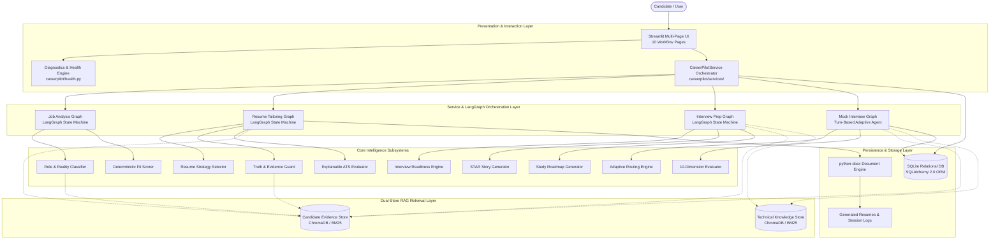
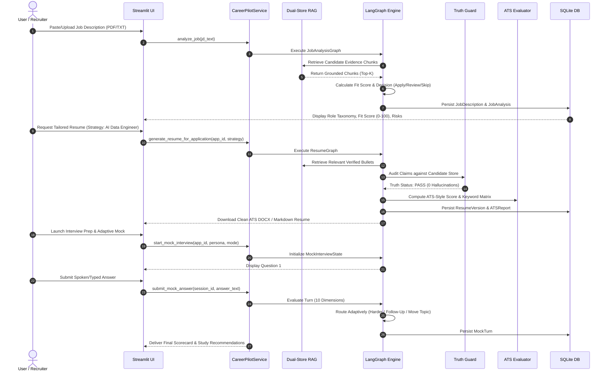
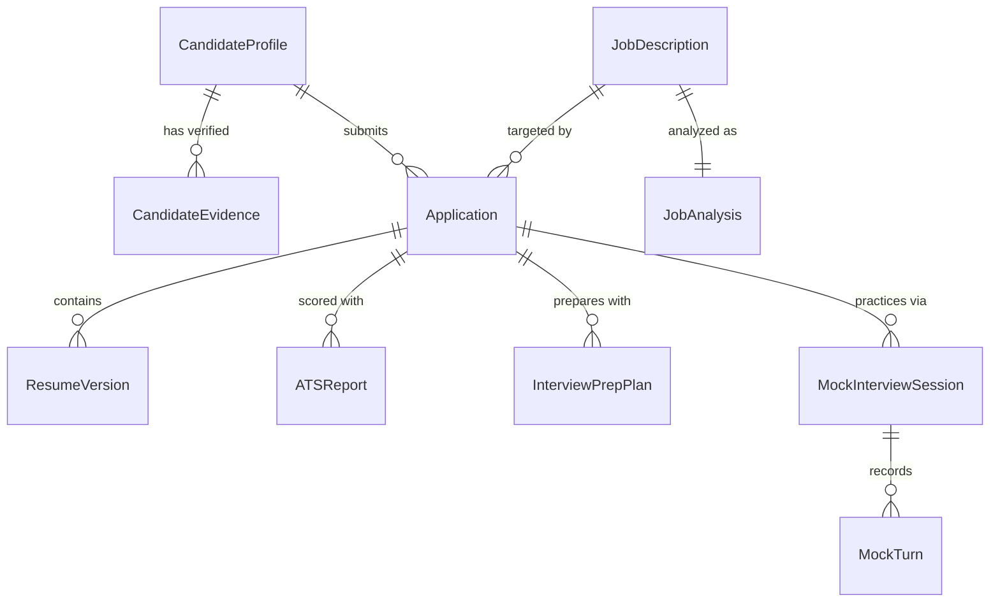

# CareerPilot AI — Complete Final Architecture Specification

**Version:** 1.0.0  
**Author:** CareerPilot AI Engineering Team  
**Classification:** Enterprise System Architecture & Data Flow Specification  

---

## 1. Executive Summary & Core Positioning

**CareerPilot AI** is an evidence-grounded AI career intelligence platform that:
1. Analyzes job descriptions to uncover real role taxonomy, tech stack distributions, and must-have requirements.
2. Evaluates candidate-job fit scores with deterministic missing-skill penalties.
3. Tailors evidence-grounded resumes without hallucinating unverified claims, exporting clean ATS-compliant DOCX documents.
4. Performs explainable ATS-style compatibility and formatting risk analysis.
5. Generates personalized technical Q&A, STAR behavioral stories, and multi-day study roadmaps.
6. Conducts multi-turn, 10-dimensional adaptive mock interviews with live coaching feedback.

> [!IMPORTANT]
> **Core Architectural Formula:**  
> $$\text{CareerPilot Intelligence} = \text{Verified Evidence Grounding} + \text{Dual-Store RAG} + \text{LangGraph State Machines} + \text{Deterministic Rule Engines}$$

---

## 2. High-Level System Architecture Diagram



---

## 3. End-to-End Data Flow Pipeline

The complete end-to-end data lifecycle passes through 15 discrete transformations from raw job posting to final mock interview diagnostic:



---

## 4. LangGraph State Machine Architectures

### 4.1 Job Analysis Graph
```
START
  │
  ▼
[parse_job_node] ──────> Extracts title, company, clean text, technologies
  │
  ▼
[classify_role_node] ──> Classifies role (e.g. AI_DATA_ENGINEER) & work distribution
  │
  ▼
[extract_reqs_node] ───> Segregates MUST_HAVE vs NICE_TO_HAVE requirements
  │
  ▼
[retrieve_evidence_node] -> Queries Candidate Evidence Store via RRF retrieval
  │
  ▼
[compute_fit_node] ────> Computes weighted score with must-have penalty
  │
  ▼
[analyze_risks_node] ──> Detects seniority gaps, cloud misalignments, missing tooling
  │
  ▼
[decision_node] ───────> Recommends APPLY (>=75), REVIEW (55-74), or SKIP (<55)
  │
  ▼
 END
```

### 4.2 Resume Tailoring Graph
```
START
  │
  ▼
[load_job_analysis_node] ────> Ingests target role requirements & identified strengths
  │
  ▼
[select_strategy_node] ─────> Picks strategy (DATA_ENGINEER / AI_DATA_ENGINEER / GENAI)
  │
  ▼
[retrieve_bullets_node] ────> Fetches candidate verified evidence from ChromaDB
  │
  ▼
[draft_resume_node] ────────> Assembles Summary, Experience, Projects, Skills
  │
  ▼
[truth_guard_node] ─────────> Verifies every claim against candidate evidence ledger
  │
  ├── [If BLOCK / VIOLATIONS] ──> [remediate_draft_node]
  │
  ▼
[ats_precheck_node] ────────> Computes 7-component ATS compatibility score
  │
  ▼
[export_artifacts_node] ────> Generates Markdown & ATS-compliant DOCX
  │
  ▼
 END
```

### 4.3 Interview Preparation Graph
```
START
  │
  ▼
[generate_seed_node] ───────> Builds InterviewReadinessSeed from ATS & Job Analysis
  │
  ▼
[retrieve_knowledge_node] ──> Dual retrieval: Candidate Evidence + Technical Knowledge
  │
  ▼
[generate_questions_node] ──> Generates 7 question categories (Tech, Scenario, System Design)
  │
  ▼
[generate_answers_node] ────> Generates tiered answers (Short, Standard, Deep Dive, STAR)
  │
  ▼
[generate_roadmap_node] ────> Compiles 1-day, 3-day, 7-day, and 14-day study plans
  │
  ▼
 END
```

### 4.4 Adaptive Mock Interview Graph
```
START
  │
  ▼
[initialize_session_node] ──> Loads target JD, tailored resume, and candidate seed
  │
  ▼
[select_question_node] ─────> Selects question based on active mode & difficulty
  │
  ▼
[await_user_answer] ────────> Interactivity boundary (Human-in-the-loop answer submission)
  │
  ▼
[evaluate_answer_node] ─────> Evaluates turn across 10 rubrics (Correctness, Evidence, Clarity)
  │
  ▼
[adaptive_routing_node] ────> Branching:
  ├── Performance >= 85% ────> Increase difficulty or ask advanced system design
  ├── Performance 60-84% ────> Ask standard follow-up probe on methodology
  └── Performance < 60%  ────> Provide hint / clarification or reinforce core concept
  │
  ▼
[If turns remaining] ───────> Loop back to [select_question_node]
  │
  ▼
[finalize_report_node] ─────> Emits overall diagnostic report, radar scores, study priorities
  │
  ▼
 END
```

---

## 5. Storage Schema & Entity Relationships



---

## 6. Security, Isolation & Environment Modes

1. **`DEMO` Mode (Public Default):**
   - Active Candidate: **Alex Rivera** (Senior Data & AI Systems Engineer, 4.5+ years experience).
   - Storage: Isolated demo SQLite (`data/demo/careerpilot_demo.db`) and demo vector index (`data/demo/chroma_db/`).
   - Safe for public web deployment on Streamlit Community Cloud and Hugging Face Spaces.
2. **`LOCAL_PRIVATE` Mode:**
   - Active Candidate: Local verified candidate data in `data/candidate/` or `data/private/`.
   - Excluded from version control via `.gitignore`.
