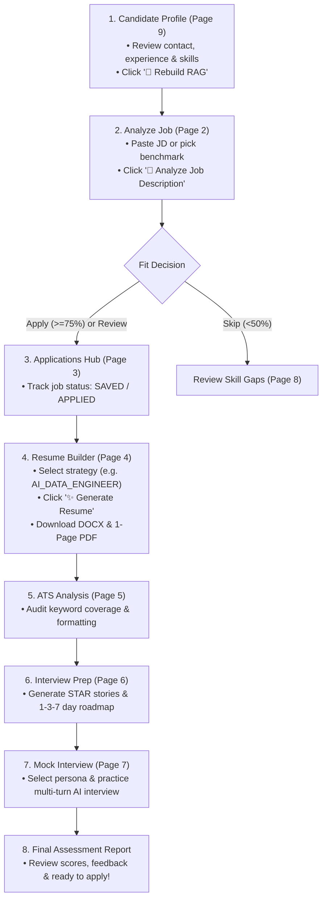

# CareerPilot AI — Complete UI & Feature Reference Manual

This guide provides an exhaustive, button-by-button, feature-by-feature breakdown of the **CareerPilot AI** Streamlit application.

---

## 🧭 Global Sidebar & Environment Controls

| UI Element | Type | Purpose & Action |
| :--- | :--- | :--- |
| **🚀 CareerPilot AI Title** | Header | Main application branding and subtitle. |
| **Environment Badge** | Status Box | Indicates whether the app is in **LOCAL PRIVATE** mode (operating on personal candidate data in SQLite/ChromaDB) or **DEMO MODE** (synthetic profile Alex Rivera). |
| **Candidate Identity Card** | Info Box | Displays candidate Name, Current Location, Verified Experience (e.g. 1.9+ Years at Cognizant), and Primary Cloud/Tech Stack. |
| **Ground-Truth Lock Badge** | Security Status | Confirms that candidate baseline evidence is immutable and protected against LLM hallucinations. |
| **📊 Quick Stats Counter** | Dynamic Stats | Real-time counts of: Total Analyzed Jobs, Recommended Apply Decisions, Applications Submitted, and Completed Mock Interviews. |
| **Sidebar Navigation Links** | Page Switcher | Links to all 12 core application pages. |

---

## 🏠 Page Overview & Navigation Hub (`app.py`)

### Purpose
The landing dashboard introducing CareerPilot AI's core capabilities, workflow pipelines, and live system status.

### Features & Interactive Elements:
- **Welcome Banner & Sub-header:** Overview of the autonomous career intelligence platform.
- **Workflow Pipeline Diagram:** Interactive visual flowchart displaying the complete lifecycle:
  `JD Input ➔ Job Fit Analysis ➔ Application Tracker ➔ Tailored Resume Builder ➔ ATS Scanner ➔ Interview Preparation ➔ AI Mock Interviewer`.
- **Feature Highlights Cards:** Quick-start cards explaining each subsystem.
- **System Initialization Hook (`@st.cache_resource`):** Automatically initializes ChromaDB collections (`candidate_evidence`, `interview_knowledge`) and SQLite tables on startup.

---

## 📊 Page 1: Dashboard (`1_Dashboard.py`)

### Purpose
Central command center displaying high-level career metrics, application funnel status, recent activities, and priority study recommendations.

### Features, Metrics & Tables:
1. **Top Metric KPI Cards:**
   - **Total Jobs Analyzed:** Number of job descriptions evaluated.
   - **Recommended Apply:** Number of jobs receiving a deterministic `APPLY` decision (Fit Score $\ge 75\%$).
   - **Active Applications:** Applications currently marked `APPLIED`, `INTERVIEWING`, or `OFFER`.
   - **Interviews Completed:** Total multi-turn AI mock interview sessions completed.
2. **Left Column — Application Funnel & Status Breakdown:**
   - Visual status metrics across `SAVED`, `APPLIED`, `INTERVIEWING`, `OFFER`, and `REJECTED`.
   - **Recent Applications Table:** Interactive dataframe displaying Company, Job Title, Fit Score, Recommendation Badge (`APPLY`, `REVIEW`, `SKIP`), and Status.
3. **Right Column — Preparation Focus & Mock History:**
   - **🎯 Preparation Weaknesses & Study Focus:** Highlights candidate's top 4 priority learning topics extracted from job analyses.
   - **🎙️ Recent Mock Interview Sessions Table:** Displays Session ID, Target Role, Difficulty, Turn Count, Score (%), Status, and Date.

---

## 🔍 Page 2: Analyze Job (`2_Analyze_Job.py`)

### Purpose
Parses any Job Description (JD), classifies the true technical role reality, runs candidate RAG retrieval, computes deterministic fit scores, and outputs actionable decisions (`APPLY`, `REVIEW`, or `SKIP`).

### Tabs, Inputs & Buttons:

#### 1. Input Methods (`📝 Provide Job Description` Expander)
- **Tab 1: 📋 Paste JD Text:**
  - `Job Title (Optional)` (Text Input): Custom job title override.
  - `Company Name (Optional)` (Text Input): Target employer name.
  - `Job Location (Optional)` (Text Input): Defaults to "Remote / Flexible".
  - `Job URL (Optional)` (Text Input): Link to the live job posting.
  - `Job Description Content` (Text Area): Raw text of the job description.
- **Tab 2: 📁 Upload File (TXT/PDF):**
  - `Upload Job Description File` (File Uploader): Accepts `.txt` and `.pdf` files up to 10MB.
- **Tab 3: 📂 Load Evaluation Benchmark:**
  - `Select Evaluation Benchmark Job` (Selectbox): Dropdown of 10 representative industry benchmark jobs (`01_ai_data_engineer.txt`, `02_data_engineer_gcp.txt`, etc.).

#### 2. Action Buttons:
- **`🚀 Analyze Job Description` (Primary Button):**
  - Executes LangGraph Job Analysis workflow:
    1. Parses JD structure, responsibilities, and must-have/nice-to-have requirements.
    2. Classifies primary role category and actual day-to-day work reality distribution.
    3. Retrieves candidate evidence from ChromaDB vector store.
    4. Computes deterministic Candidate-Job Fit Score (0–100%) and Risk Analysis.
    5. Saves application record to SQLite database and updates session state.

#### 3. Output Cards & Visualizations:
- **Fit Recommendation Badge:** Large color-coded banner (`✅ APPLY`, `⚠️ REVIEW`, or `🛑 SKIP`) with explanation.
- **Metric Bar:** Overall Fit Score (%), Must-Have Match Count, Nice-To-Have Match Count, Detected Seniority Level.
- **Role Reality & Work Breakdown (Plotly Donut Chart):** Visual percentage distribution across Data Pipelines, GenAI/LLM, Cloud Infrastructure, ML/Analytics, and Backend.
- **Key Strengths (Supported by Candidate Evidence):** Green badges showing candidate skills backed by production proof.
- **Identified Gaps & Mitigation Framing:** Yellow/Red badges detailing missing requirements and how to frame candidate's transferable knowledge (e.g. framing GCP expertise for AWS roles).
- **Interactive Action Buttons in Result Card:**
  - `💾 Save Application (Status: SAVED)`: Creates an application in SQLite.
  - `📄 Go to Resume Builder`: Direct shortcut to tailor a resume for this job.
  - `💡 Prepare for Interview`: Direct shortcut to generate interview roadmaps and STAR stories.

---

## 📋 Page 3: Applications Hub (`3_Applications.py`)

### Purpose
Comprehensive Kanban and list manager tracking all job applications through their complete lifecycle.

### Filters & Controls:
- **Search Bar (`🔍 Search Applications`):** Real-time text search filtering by company name, job title, or notes.
- **Status Filter Dropdown:** Filter by `ALL`, `SAVED`, `APPLIED`, `INTERVIEWING`, `OFFER`, or `REJECTED`.
- **Sort Dropdown:** Sort by Date Added, Fit Score, or Company Name.

### Application Cards & Action Controls:
Each application card displays:
- Company, Job Title, Date Analyzed, Fit Score, and Recommendation Badge.
- **`Update Status` (Dropdown):** Change application state (e.g. from `SAVED` to `APPLIED`).
- **`Add Note / Update Log` (Text Input + Button):** Append interview notes, recruiter contacts, or follow-up dates.
- **`📄 Tailor Resume` (Button):** Navigates to Resume Builder with this application pre-selected.
- **`🎯 View ATS Analysis` (Button):** Navigates to ATS Analysis for this application.
- **`🎙️ Practice Interview` (Button):** Launches Mock Interview configured for this role.

---

## 📄 Page 4: Resume Builder (`4_Resume_Builder.py`)

### Purpose
Generates strictly 1-page, ATS-compliant, evidence-grounded PDF and Word DOCX resumes aligned to chosen tailoring strategies without fabricating experience.

### Inputs & Controls:
1. **Target Application Selectbox:** Select any analyzed job from your applications.
2. **Version History Dropdown:** Browse and inspect previously generated resume versions for this job (`v1.0`, `v2.0`, etc.) with ATS scores and timestamps.
3. **Tailoring Strategy Selectbox:** Choose resume positioning:
   - `AUTO` (Determined dynamically by Job Classifier)
   - `AI_DATA_ENGINEER` (Emphasizes pipelines + Vertex AI / Gemini agent projects)
   - `DATA_ENGINEER` (Emphasizes BigQuery, Airflow, ETL validation, and latency)
   - `GENAI_ENGINEER` (Emphasizes LLMs, RAG, embeddings, and prompt orchestration)
   - `GCP_DATA_ENGINEER` (Emphasizes Google Cloud infrastructure, Pub/Sub, and GCS)
4. **`✨ Generate Resume` (Primary Button):**
   - Assembles verified candidate experience, skills, and top 2 projects.
   - Runs Truth Guard validation against prohibited claims and metrics.
   - Compiles Word DOCX and vector PDF artifacts.
   - Saves new version snapshot to SQLite.

### Output Tabs & Download Artifacts:
- **Tab 1: 📄 ATS Resume Preview:** Clean rendering of Header, Professional Summary, Core Skills, Work Experience, Key Projects, Education, and Certifications.
- **Tab 2: 🛡️ Truth Guard Verification Ledger:** Itemized breakdown of all verified claims, zero ungrounded assertions, and truth audit status (`PASS`).
- **Tab 3: 📊 ATS Pre-Check Alignment:** Immediate compatibility score and keyword match highlights.
- **Export & Download Actions:**
  - **`📥 Download ATS Word Resume (.docx)` (Download Button):** Semantic, tableless, ATS-friendly Word document.
  - **`📥 Download ATS Vector PDF (.pdf)` (Download Button):** Strictly 1-page, searchable vector PDF with ReportLab adaptive typography.

---

## 🎯 Page 5: ATS Analysis (`5_ATS_Analysis.py`)

### Purpose
Deep-dive ATS compatibility auditor that scans tailored resumes against job requirements, identifies missing keywords, detects formatting traps, and provides actionable optimization suggestions.

### Sections & Visualizations:
1. **Application Selector:** Choose target application to audit.
2. **`🔍 Run Full ATS Scan` (Primary Button):** Executes ATS Evaluator scoring algorithm.
3. **ATS Score Gauge & Breakdown:**
   - Overall ATS Compatibility Score (0–100%).
   - Must-Have Keywords Match Ratio (e.g. 10/10).
   - Nice-To-Have Match Ratio.
   - Section Integrity & ATS Formatting Score.
4. **Keyword Coverage Matrix (Interactive Table):**
   - Categorized by skill, importance (`MUST_HAVE` vs `NICE_TO_HAVE`), exact/synonym match status, and candidate evidence source.
5. **ATS Formatting Audit:**
   - Table trap check (Zero hidden tables).
   - Multi-column trap check (Single-column layout verified).
   - Header/Footer trap check (Contact info in document body).
   - Non-standard font and symbol check.
6. **Actionable Suggestions:** Concrete advice on keyword placement and transferable skill framing.

---

## 💡 Page 6: Interview Prep (`6_Interview_Prep.py`)

### Purpose
Generates role-specific interview preparation kits including grounded STAR behavioral stories, deep-dive technical probing questions, system design walkthroughs, and structured study roadmaps.

### Controls & Tabs:
1. **Target Application Selectbox:** Select target job.
2. **`⚡ Generate Interview Prep Kit` (Primary Button):** Runs LangGraph Interview Prep Graph.
3. **Interactive Tabs:**
   - **Tab 1: ⭐ Grounded STAR Stories:** Behavioral answers built directly from verified candidate projects (Situation, Task, Action, Result) with exact metrics.
   - **Tab 2: 🧠 Technical Deep-Dive Q&A:** Likely technical questions mapped to candidate tech stack with ideal answers and architectural talking points.
   - **Tab 3: 🏗️ System Design Scenarios:** End-to-end architectures, data flow diagrams, scaling trade-offs, and failure recovery strategies.
   - **Tab 4: 📅 1-3-7 Day Study Roadmaps:** Daily preparation schedules prioritized by job importance and candidate gaps.

---

## 🎙️ Page 7: Mock Interview (`7_Mock_Interview.py`)

### Purpose
Interactive, multi-turn AI interview simulator with dynamic difficulty adaptation, real-time answer scoring, hint assistance, and full STAR assessment.

### Configuration Controls (Before Starting):
- **Target Application:** Select job role.
- **Interview Mode:** `FULL_INTERVIEW`, `TECHNICAL_DEEP_DIVE`, `BEHAVIORAL_STAR`, or `SYSTEM_DESIGN`.
- **Difficulty Adaptation:** `ADAPTIVE` (Adjusts based on candidate answer quality), `JUNIOR`, `MID_LEVEL`, `SENIOR`, or `STAFF_PRINCIPAL`.
- **Interviewer Persona:** `SUPPORTIVE_COACH`, `RIGOROUS_TECHNICAL_LEAD`, `BAR_RAISER`, or `FAST_PACED_STARTUP_CTO`.
- **Feedback Mode:** `COACHING_MODE` (Immediate feedback per turn) or `INTERVIEW_MODE` (Realistic silence with final end-of-interview report).
- **Total Questions Planned:** Slider from 2 to 12 questions.
- **`🚀 Start Mock Interview Session` (Primary Button):** Launches active session.

### Active Interview Controls (During Session):
- **Interviewer Card:** Displays current question, turn number, topic, difficulty level, and follow-up depth.
- **`Your Answer:` (Text Area):** Candidate response box.
- **`💡 Small Hint (-5%)` (Button):** Provides a subtle architectural hint with minor score penalty.
- **`💡 Full Hint (-15%)` (Button):** Provides key concepts and structural guidance with moderate score penalty.
- **`🤷 I Don't Know` (Button):** Submits honest gap response to test graceful gap-handling.
- **`💬 Submit Answer & Continue` (Primary Button):** Evaluates answer across 10 dimensions, checks Truth Guard, updates difficulty, and selects next question or follow-up probe.
- **`🏁 Finish Interview & Generate Report` (Button):** Concludes session early and generates Final Assessment Report.

### Post-Interview Report:
- Overall Readiness Score (0–100%).
- Dimension breakdown (Technical Depth, Problem Solving, Communication, Metric Grounding, Truthfulness).
- Detailed per-question feedback with improvement recommendations.

---

## 📈 Page 8: Skill Gaps (`8_Skill_Gaps.py`)

### Purpose
Aggregated portfolio-level intelligence identifying recurring skill gaps, market demand trends across all analyzed jobs, and personalized learning paths.

### Features & Visualizations:
1. **Top Metric Cards:** Total Unique Requirements Analyzed, Verified Skills Count, High-Priority Gaps Identified.
2. **Skill Demand vs Candidate Coverage Matrix:** Comparative chart showing which technologies appear most frequently across candidate's target jobs vs candidate's proficiency.
3. **Priority Learning Topics:** Ranked list of high-leverage topics to study (e.g. Terraform on GCP, Kafka streaming, dbt).
4. **Targeted Learning Roadmaps:** Recommended documentation, tutorials, and practical projects to close detected gaps.

---

## 👤 Page 9: Candidate Profile Manager (`9_Candidate_Profile.py`)

### Purpose
Authoritative candidate data hub. Allows complete CRUD management (Add, Edit, Delete) for all candidate facts, master resume imports, change diff auditing, version rollbacks, and Candidate RAG re-indexing without editing raw files.

### Top Bar Controls:
- **Metric Cards:** Profile Completeness (%), Calculated Professional Experience (deterministic e.g. `1.9 yrs`), RAG Sync Status (`SYNCED` / `NEEDS_SYNC`), Indexed Evidence Chunks.
- **`🔄 Rebuild RAG` (Button):** Clears and re-indexes all candidate evidence into ChromaDB.

### 9 Interactive Management Tabs:

#### Tab 1: 👤 Overview
- **Fields:** Full Name, Email, Phone, Location, LinkedIn URL, GitHub URL, Portfolio URL, Master Professional Summary.
- **`💾 Save Profile Overview` (Form Button):** Updates contact info and syncs to RAG.

#### Tab 2: 💼 Professional Experience (Full CRUD)
- **`➕ Add New Experience` (Expander Form):**
  - Company Name, Job Title, Location, Start Date (`MM/YYYY`), End Date (`Present` or `MM/YYYY`), Current Position Checkbox, Responsibilities (1 per line), Technologies Used, Verified Metrics.
  - **`➕ Add Experience Record` (Button):** Appends experience and recalculates total tenure.
- **Existing Experience Cards (Item-Level Edit & Delete):**
  - Expandable form for each role with pre-filled fields.
  - **`💾 Update Experience` (Button):** Saves edits to specific role.
  - **`🗑️ Delete Experience` (Button):** Removes role with instant confirmation.

#### Tab 3: 🚀 Projects (Full CRUD)
- **`➕ Add New Project` (Expander Form):**
  - Project Name, Project Type (`PERSONAL_PROJECT` vs `PROFESSIONAL_EXPERIENCE`), Description, Technologies, Responsibilities, Highlights, Metrics.
  - **`➕ Add Project Record` (Button):** Adds project to profile.
- **Existing Project Cards:**
  - **`💾 Update Project` (Button):** Edits existing project details.
  - **`🗑️ Delete Project` (Button):** Deletes project from database.

#### Tab 4: 🛠️ Skills & Evidence (Full CRUD)
- **`➕ Add New Skill` (Expander Form):**
  - Skill Name, Category (`PROGRAMMING`, `CLOUD`, `ORCHESTRATION`, `GENAI`, `FRAMEWORK`, `DATABASE`), Evidence Level (`PROFESSIONAL`, `PERSONAL_PROJECT`, `LEARNING_KNOWLEDGE`), Evidence Status (`VERIFIED`, `PARTIAL`, `UNSUPPORTED`), Proficiency (`Beginner`, `Proficient`, `Advanced`, `Expert`), Years of Experience.
  - **`➕ Add Skill Record` (Button):** Adds verified skill.
- **Existing Skills Table & Edit/Delete Forms:**
  - Interactive skill table sorted by category and evidence tier.
  - **`💾 Update Skill` (Button)** and **`🗑️ Delete Skill` (Button)** for each individual skill.

#### Tab 5: 🎓 Education (Full CRUD)
- **`➕ Add New Education` (Expander Form):**
  - Degree (e.g. `B.Tech (Artificial Intelligence)`), Institution (e.g. `G. H. Raisoni College of Engineering, Nagpur`), Field of Study, Graduation Year, GPA / Honors.
  - **`➕ Add Education Record` (Button):** Saves academic credential.
- **Existing Education Cards:**
  - **`💾 Update Education` (Button):** Edits institution, degree, or GPA.
  - **`🗑️ Delete Education` (Button):** Removes education entry.

#### Tab 6: 🏆 Certs & Achievements (Full CRUD)
- **Certifications Section:**
  - `New Certification Name` (Text Input) + **`➕ Add Certification` (Button)**.
  - List of active certifications with individual **`🗑️ Delete` (Button)**.
- **Achievements Section:**
  - `New Achievement / Key Metric` (Text Area) + **`➕ Add Achievement` (Button)**.
  - List of verified achievements with individual **`🗑️ Delete` (Button)**.

#### Tab 7: 🎯 Preferences
- Target Job Roles (Multi-select), Target Seniority Levels (Multi-select), Preferred Work Modes (`REMOTE`, `HYBRID`, `ONSITE`), Target Locations, Primary & Secondary Cloud Preferences.
- **`💾 Save Career Preferences` (Button):** Updates career search criteria.

#### Tab 8: 📥 Resume Import & Diff Audit
- `Upload Master Resume (.pdf or .docx)` (File Uploader): Extracts structured candidate data from external resume files.
- **Diff Matrix Table:** Visual side-by-side comparison showing `ADDED`, `REMOVED`, `CHANGED`, and `UNCHANGED` items.
- **`Approve / Reject` Checkboxes:** Granularly accept only the desired changes.
- **`🚀 Merge Approved Changes to Profile` (Primary Button):** Updates active profile and synchronizes RAG.

#### Tab 9: 🕒 Version History & Snapshot Rollback
- Displays chronological list of all saved profile snapshots with change summaries and timestamps.
- **`🔄 Restore This Version` (Button):** One-click instant rollback to any prior profile snapshot.

---

## ⚙️ Page 10: Settings & Diagnostics (`10_Settings.py`)

### Purpose
System diagnostics, LLM model settings, embedding configurations, and candidate safety status.

### Features:
- **Candidate Ground-Truth Protection Banner:** Confirms candidate files in `data/candidate/` are protected.
- **LLM & RAG Provider Card:** Active model (`gemini-2.5-pro` or fallback), Embedding Model (`all-MiniLM-L6-v2`), ChromaDB collection names.
- **Deterministic Decision Thresholds Card:** Displays fit score cutoff boundaries ($\ge 75\%$ Apply, $50–74\%$ Review, $<50\%$ Skip).
- **Candidate Verified Profile Overview:** Fast summary of active candidate metadata.

---

## ℹ️ Page 11: About & Architecture (`11_About.py`)

### Purpose
System architecture documentation, anti-hallucination philosophy, Truth Guard rules, and technology stack overview.

### Features:
- **Core Design Principles:** Zero-Fabrication guarantee, Deterministic Scoring, Dual-Store RAG, Single-Page ATS standard.
- **Architecture Diagram:** Multi-agent LangGraph orchestrator layout.
- **Truth Guard Rules Catalog:** Prohibited claim patterns, verified metrics validation, and transferable cloud knowledge boundaries.

---

## 🧪 Page 12: Evaluation Benchmarks (`12_Evaluation.py`)

### Purpose
Developer and evaluation dashboard displaying empirical benchmark results, RAG retrieval quality, Truth Guard confusion matrices, latency percentiles, and LangSmith/local trace observability.

### Metrics & Benchmarks:
- **Top Metric Bar:** Candidate RAG Recall@5, Mean Reciprocal Rank (MRR), Truth Guard Precision (100%), Truth Guard Recall (100%), Average End-to-End Latency.
- **Tab 1: 🔍 Job Analysis Benchmark:** Evaluation scores across all 10 representative industry test jobs.
- **Tab 2: 📚 RAG Retrieval Metrics:** Hit rate, recall, and chunk relevance distributions.
- **Tab 3: 🛡️ Truth Guard Confusion Matrix:** Precision, Recall, False Positives (0.0%), and False Negatives (0.0%).
- **Tab 4: 📄 Resume Quality Benchmark:** ATS score distributions and single-page compliance rates.
- **Tab 5: 🎙️ Mock Interview Engine Evaluation:** STAR evaluation fidelity and difficulty adaptation accuracy.
- **Tab 6: ⏱️ Observability & Latency Traces:** p50, p90, p99 latency breakdowns and token cost metrics.

---

## 🔁 End-to-End Recommended User Workflow

