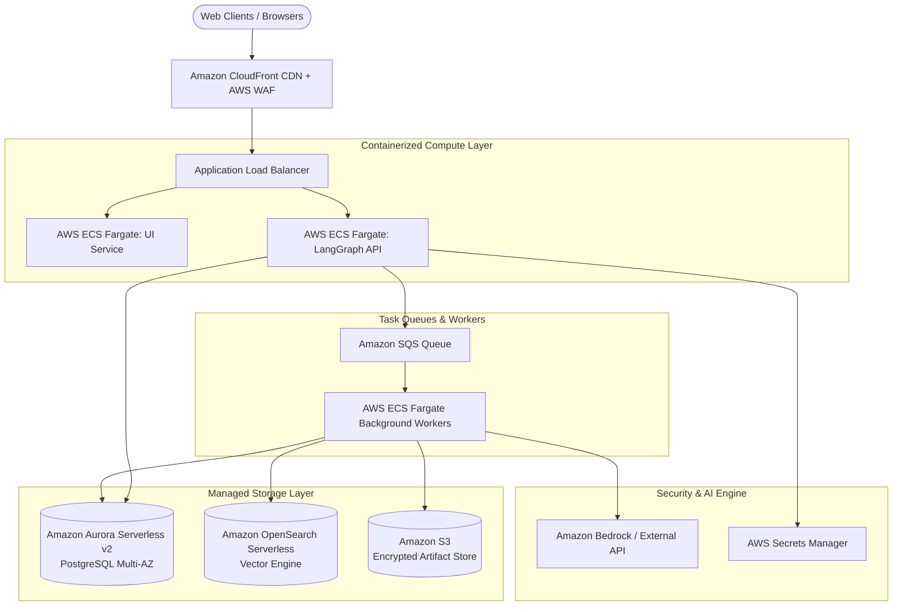

# CareerPilot AI — Production Cloud Scaling Design Proposal

**Document:** `docs/CLOUD_SCALING_DESIGN.md`  
**Classification:** Conceptual Architecture & Cloud Migration Blueprint  
**Notice:** *This document represents a proposed production-scale architecture for migrating CareerPilot AI from a local single-user system to high-availability multi-tenant cloud infrastructure. It does not represent an existing production deployment.*

---

## 1. System Evolution Overview

| Architecture Dimension | Current Implementation (Local) | Proposed GCP Enterprise Architecture | Proposed AWS Enterprise Architecture |
| :--- | :--- | :--- | :--- |
| **Application Layer** | Streamlit Local Process | Cloud Run (FastAPI + Streamlit Containers) | AWS ECS Fargate + ALB |
| **Relational Database** | SQLite (`data/careerpilot.db`) | Google Cloud SQL (PostgreSQL 15) | Amazon Aurora Serverless v2 (PostgreSQL) |
| **Vector Database** | ChromaDB Local Directory | Google Vertex AI Vector Search | Amazon OpenSearch Serverless / Pinecone |
| **Object / Artifact Storage** | Local File System (`data/generated/`) | Google Cloud Storage (GCS) Buckets | Amazon S3 (Encrypted at Rest) |
| **Async Task Queue** | Synchronous In-Process Execution | Google Cloud Tasks / Celery on Redis | Amazon SQS + Celery on Redis |
| **LLM Provider** | Google Gemini API / Local Ollama | Vertex AI Gemini 1.5 Pro / Flash | AWS Bedrock (Claude 3.5 / Llama 3) |
| **Secret Management** | Local `.env` / Streamlit Secrets | Google Cloud Secret Manager | AWS Secrets Manager |
| **Observability & Logs** | Local Python `logging` | Google Cloud Logging & Trace | Amazon CloudWatch & AWS X-Ray |

---

## 2. Proposed Google Cloud Platform (GCP) Architecture

```mermaid
flowchart TD
    User([Web Clients / Browsers]) --> CloudArmor[Google Cloud Armor\nWAF & DDoS Protection]
    CloudArmor --> GCLB[Global External HTTP(S) Load Balancer]
    
    subgraph Compute_Layer [Serverless Compute Layer]
        GCLB --> CloudRunUI[Cloud Run: Streamlit Frontend]
        GCLB --> CloudRunAPI[Cloud Run: FastAPI Backend & LangGraph Workers]
    end
    
    subgraph Async_Workers [Asynchronous Task Orchestration]
        CloudRunAPI --> CloudTasks[Google Cloud Tasks Queue]
        CloudTasks --> WorkerPods[Cloud Run Background Worker Containers]
    end
    
    subgraph Data_Storage [Managed Data & State Layer]
        CloudRunAPI --> CloudSQL[(Google Cloud SQL\nPostgreSQL Multi-AZ)]
        WorkerPods --> CloudSQL
        WorkerPods --> VertexSearch[(Vertex AI Vector Search\nManaged Dense Embeddings)]
        WorkerPods --> GCS[(Google Cloud Storage\nDOCX Resumes & Transcripts)]
    end
    
    subgraph AI_Security [Managed AI & Secret Layer]
        WorkerPods --> VertexAI[Vertex AI Gemini API]
        CloudRunAPI --> SecretMgr[Google Secret Manager]
    end
```

### Key GCP Design Decisions:
1. **Serverless Auto-Scaling:** Cloud Run containers scale from 0 to 100+ instances based on incoming request volume, eliminating idle server costs.
2. **Asynchronous Resume & Prep Jobs:** Heavy LangGraph multi-step runs (Resume tailoring, study roadmaps) are dispatched to Google Cloud Tasks, preventing HTTP request timeouts on the frontend.
3. **Multi-Region Vector Search:** Google Vertex AI Vector Search provides sub-millisecond approximate nearest neighbor (ANN) retrieval across millions of candidate and knowledge chunks.

---

## 3. Proposed Amazon Web Services (AWS) Architecture



---

## 4. Cost, Concurrency & Rate-Limiting Strategy

1. **Caching Frequent Job Analysis:** Job descriptions for popular tech roles (e.g. standard SWE or Data Engineer postings) can be hashed and cached in Redis, avoiding duplicate parsing and embedding calls.
2. **Embedding Token Efficiency:** Batching vector insertions during candidate profile indexing reduces API overhead.
3. **Database Connection Pooling:** Using PgBouncer / Google Cloud SQL Auth Proxy to support 10,000+ concurrent UI sessions without overwhelming database connection limits.
