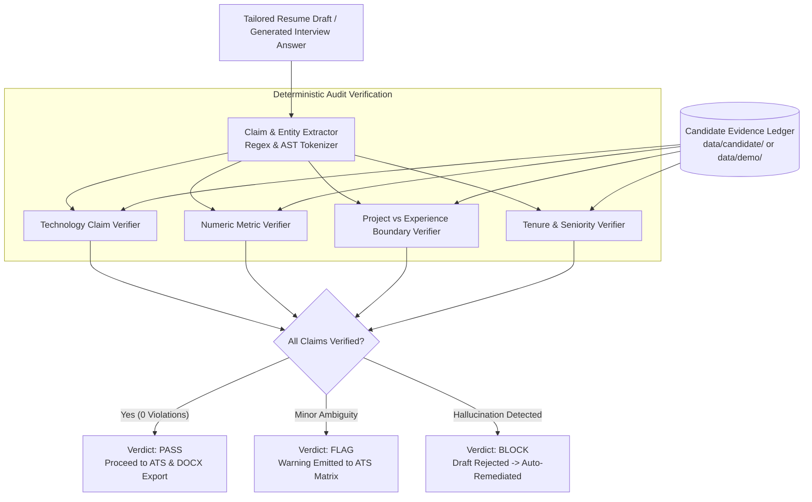

# CareerPilot AI — Truth Guard & Anti-Hallucination Specification

**Document:** `docs/TRUTH_GUARD.md`  
**Purpose:** Specification of the deterministic Truth Guard engine, evidence classification taxonomy, and anti-fabrication verification pipeline.

---

## 1. The Core Problem: LLM Self-Evaluation Fallacy

Standard LLM applications rely on the model itself to "be honest" through prompt instructions (e.g. *"Please do not lie or invent experience"*).

**Why this fails in practice:**
1. **Instruction Degradation:** When prompted to optimize for ATS keywords or target roles, LLMs prioritize helpfulness/relevance over strict factual boundary enforcement.
2. **Fabrication of Missing Tools:** If a JD lists *Kubernetes* as a must-have, an unconstrained LLM will invent a bullet claiming *"Orchestrated Docker containers in Kubernetes clusters"*.
3. **Metric Inflation:** LLMs round up or exaggerate impact numbers (e.g., turning *2.5M records* into *10M records* or *30% cost reduction* into *50%*).

**CareerPilot's Architectural Solution:**  
The **Truth Guard** is an independent, deterministic audit layer implemented outside the LLM's own self-judgment.

---

## 2. The 3-Tier Evidence Classification Taxonomy

Every skill, technology, metric, and achievement in the candidate knowledge base is classified into one of three strict tiers:

```
┌─────────────────────────┬────────────────────────────────────────────────────────────────────────┐
│ Evidence Status         │ Definition & Resume/Interview Permissions                              │
├─────────────────────────┼────────────────────────────────────────────────────────────────────────┤
│ SUPPORTED               │ Directly verified in candidate ground truth (production work or        │
│                         │ verified project). Permitted in Experience and Projects sections.      │
├─────────────────────────┼────────────────────────────────────────────────────────────────────────┤
│ PARTIALLY_SUPPORTED     │ Conceptual or transferable knowledge (e.g. AWS Redshift when candidate │
│                         │ has GCP BigQuery experience). Allowed ONLY as transferable framing in  │
│                         │ interview answers. BLOCKED from Professional Experience bullets.       │
├─────────────────────────┼────────────────────────────────────────────────────────────────────────┤
│ NOT_SUPPORTED           │ Unverified technology or unestablished claim. Strictly BLOCKED from    │
│                         │ resumes. If required by JD, flagged as a GAP in ATS reports.           │
└─────────────────────────┴────────────────────────────────────────────────────────────────────────┘
```

---

## 3. Truth Guard Verification Pipeline



---

## 4. Concrete Audit Scenarios & Verification Rules

### Scenario 1: Supported Production Experience
- **Draft Bullet:** *"Designed and optimized automated ETL pipelines in Google BigQuery and Apache Airflow, processing 2.5M+ daily event records."*
- **Ground Truth:** `data/demo/experience.md` lists Apex Cloud Solutions: BigQuery, Airflow, 2.5M+ daily records.
- **Truth Guard Action:** **PASS** (Claim verified with 100% confidence).

### Scenario 2: Unverified Technology Claim (Blocked)
- **Draft Bullet:** *"Managed distributed Kafka streaming clusters and deployed microservices on Kubernetes."*
- **Ground Truth:** Candidate has no verified Kafka or Kubernetes production records.
- **Truth Guard Action:** **BLOCK** (`violation_type="UNSUPPORTED_TECHNOLOGY"`, `banned_terms=["Kafka", "Kubernetes"]`). Resume generator is forced to re-draft without fabricated tooling.

### Scenario 3: Metric Inflation (Blocked)
- **Draft Bullet:** *"Optimized analytical BigQuery SQL workloads, cutting annual query processing costs by 50%."*
- **Ground Truth:** Candidate's verified metric in `achievements.md` is *~30%*.
- **Truth Guard Action:** **BLOCK** (`violation_type="INFLATED_METRIC"`, `extracted_metric="50%"`, `allowed_metric="~30%"`).

### Scenario 4: Project Boundary Violation (Blocked)
- **Draft Bullet:** *(Under Professional Experience at Cognizant)*: *"Engineered a modular hybrid RAG vector search engine combining FAISS, ChromaDB, and BM25."*
- **Ground Truth:** The RAG system is a *Personal Project*, not enterprise client work.
- **Truth Guard Action:** **BLOCK** (`violation_type="PROJECT_BOUNDARY_VIOLATION"`). Personal projects must remain strictly within the `Projects` section and never disguised as client employment history.

---

## 5. Transferable Skill Framing in Interview Preparation

When target jobs require unverified technologies (e.g. AWS Redshift or Snowflake), Truth Guard prevents the candidate from pretending to have production experience, while generating **honest transferable responses**:

> **Recommended Interview Framing (Generated by CareerPilot):**  
> *"While my direct production data platform experience is centered on Google Cloud Platform with BigQuery, the architectural principles of analytical data warehousing—columnar storage, partitioning, clustering, and distributed execution—translate directly to AWS Redshift."*
